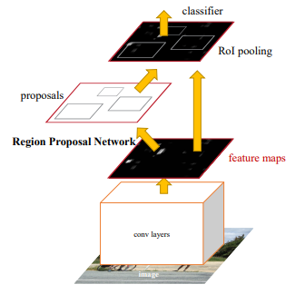

# Gun Detection


The goal of this project is to use Object detection API to fine tune Faster-RCNN-ResNet101 on scrapped images model to create gun detection model

## Dataset
1150 Scrapped images from different websites for guns or men holding guns.


## Modeling

I used Faster_RCNN_ResNet101_v1_640x640 from Tensorflow 2 Detection Model Zoo




## Results


## Blog Post

I write a blog on how I created it here: [Gun-Detection Using Object Detection API](https://hossamasaad.hashnode.dev/gun-detection-using-object-detection-api)

## Project Structure
```
.
├── requirements.txt              <!--- Requirements     --->
├── README.md                     <!--- Readme           --->
├── src                           <!--- The main package --->
|   ├── scrap
|   |   ├── pages.txt
|   |   ├── scraping.py
|   |   └── rename_images.py  
|   └── data
|       ├── xml_to_csv.py
|       └── generate_tf_records.py               
├── notebooks                     <!--- Notebooks        --->
│   ├── Gun-detection.ipynb       
|   └── models                    <!--- Object Detection API --->  
├── data                          <!--- Datasets --->
│   ├── train                     <!--- training images and xmls  --->
│   ├── valid                     <!--- validation images and xmls--->
│   ├── gun-detection.pbtxt       <!--- object labels --->
│   ├── train_labels.csv          
│   └── valid_labels.csv
└── models                        <!--- Saved models --->
    └── faster_rcnn
```

## Tools
- Python
- Tensorflow
- BeautifulSoup
- OpenCV
- Pandas
- Matplotlib


``
